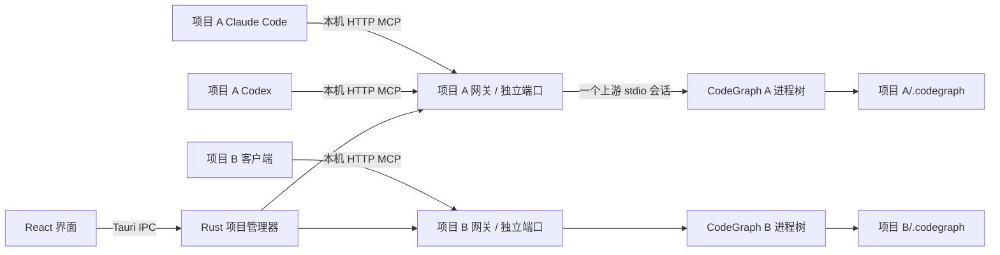
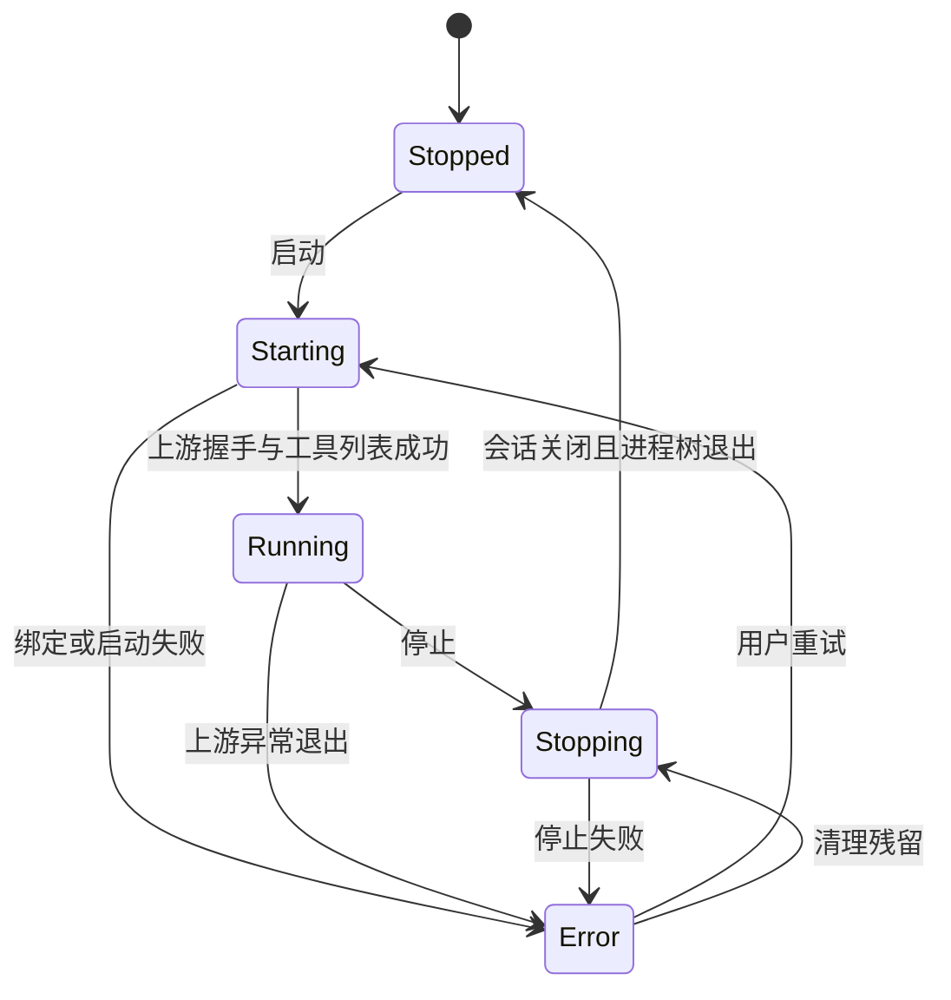

# 系统设计

状态：0.1.3 协议更新；日期：2026-10-03。客户端采用直接 HTTP，未执行的验收项以验证记录为准。

## 1. 架构决策

### 1.1 应用分层

- Web UI：React + TypeScript + Vite，负责页面、表单、任务展示和配置差异。
- Tauri 2 Rust 主进程：管理项目、进程树、本地网关、文件配置、任务与日志。
- CodeGraph：外部已安装程序，每个运行项目启动一个受管服务实例。
- `cg-mcp-connector`：仅用于兼容旧版 stdio 配置；0.1.3 新配置由客户端直接连接项目 HTTP 网关。

Rust 候选依赖：Tokio、Serde、Axum、官方 Rust MCP SDK `rmcp`、`toml_edit`、SQLite 驱动、Windows Job Object 绑定。具体 SDK 版本与接口在技术验证后锁定；不自行拼出一个不完整的 MCP 协议实现。

Tauri 使用系统 WebView 承载界面，通过受约束的 IPC 调用 Rust。[Tauri 官方架构入口](https://v2.tauri.app/start/)

### 1.2 选择项目 HTTP 网关的原因

直接在两个客户端中配置 `codegraph serve --mcp` 会分别启动服务，桌面软件无法统一控制这些进程。

客户端直接连接项目 HTTP 网关，网关共享唯一的 CodeGraph stdio 上游。项目端口和令牌持久保存，重启无需改写配置，端口占用则拒绝启动而不漂移。

### 1.3 进程与连接图



两个网关可以运行在同一个 Rust 主进程中，但分别绑定独立端口并持有独立的状态与上游连接。主进程退出会影响全部项目，这是首版的明确边界。

## 2. 项目身份与隔离

项目使用 UUID 作为稳定身份，不能以显示名称、目录 basename 或端口作为唯一标识。

- 路径在 Rust 端执行 canonicalize；Windows 使用目录实际身份辅助去重，保留适合展示的路径。
- Git worktree 使用自身工作目录作为项目根，不能按共用 Git 对象目录合并。
- 显式启动参数 `--path`、进程工作目录和 MCP roots 均绑定项目根。
- 网关固定引用一个 `ProjectContext`，客户端不能从 URL、工具参数或 roots 切换到其他项目。
- 上游工具如存在 `projectPath` 参数，缺省时注入绑定路径；显式传入其他路径则拒绝。
- 对已知文件路径参数进行相对路径、`..`、符号链接/junction 越界检查；限制可暴露工具到已验证的集合。
- 自然语言查询不通过脆弱的字符串替换来“隔离”。必须验证 CodeGraph 工具对文件路径的行为，不能证明边界的工具不得对外开放。

这里是产品级路由隔离，不宣称对恶意本机用户构成操作系统沙箱。外部 CodeGraph 仍以当前用户权限运行。

## 3. 项目生命周期

### 3.1 服务状态



索引状态单独维护：`unknown / missing / ready / indexing / error`。运行状态与索引状态不得合并成单个字段。

### 3.2 启动顺序

1. 获取项目操作锁，验证目录、CLI 入口和索引。
2. 缺少索引则返回 `INDEX_REQUIRED`，由 UI 提供初始化操作，不偷偷开展长时间扫描。
3. 实际绑定项目回环端口，持有 listener，避免“先探测空闲再绑定”的竞争。
4. 创建本次实例 `generation`，读取项目持久令牌；状态进入 Starting，尚不发布可连接记录。
5. 用参数数组启动 CodeGraph，设置工作目录和进程树归属。
6. 建立上游 stdio MCP 会话，完成 initialize、initialized 与 tools/list。
7. 校验工具 schema 与允许清单后启用网关。
8. 原子发布运行记录并推送 Running 事件。

任一步失败都回收 listener、会话和已创建进程树；保留脱敏错误。点击两次启动不能产生两个实例。

启动命令示意：

```text
<resolved-codegraph-entry> serve --mcp --path <canonical-project-root>
```

Windows 的 npm `.cmd` 启动包装不能按普通可执行文件盲目 spawn。适配器应解析并验证官方 bundle 中的运行时和入口，或者支持经验证的独立入口；保持参数数组，不拼接用户路径到 Shell 文本。当前官方 npm launcher 的运行时参数也必须保留。具体安装布局通过检测得到，不硬编码开发者用户目录。

### 3.3 停止与重启

- 停止时首先撤销运行记录并拒绝新会话，状态变为 Stopping。
- 通知当前会话服务停止；在途查询给出明确失败，不无限等待。
- 先关闭上游输入并等待宽限期，超时终止本项目所属进程树。
- Windows 使用 Job Object 管理进程树，异常退出时也能清理；不按进程名杀进程。
- 只有确认退出且端口释放才报告 Stopped；失败时保留 Error 和诊断。
- 重启是停止成功后再启动，generation 重新生成，端口与令牌保持稳定。
- 首版异常退出不无限自动重启，由用户重试。

CodeGraph 自身可能包含 daemon、watcher 和子进程。必须在技术验证中确认其复用和退出行为；不能仅关闭 launcher 就宣称停止成功。

### 3.4 索引互斥

初始化、同步、重建、启动、停止通过每项目操作锁串行协调。不同项目任务可以并行，初始索引任务全局并发默认限制为 2，可在设置中调整。

首版显式索引写操作采用维护流程：记录运行状态 → 停止受管实例 → 执行 CLI → 读取索引状态 → 原先在运行则重新启动。客户端会短暂断开，UI 必须在操作前说明。

自动 watcher 属于运行实例内部行为，不再额外执行定时 CLI sync。任务取消后重新检测数据库，不能强制取消后直接宣称索引健康。遇到外部 CodeGraph 写锁应报告占用，不自动 unlock。

## 4. MCP 桥接设计

### 4.1 两侧协议

- 客户端 ↔ 项目网关：仅 `127.0.0.1` 的 Streamable HTTP MCP。
- 项目网关 ↔ CodeGraph：一个标准 stdio MCP 客户端会话。

连接器是协议中继而非另一套索引服务。stdout 只允许协议消息，诊断写 stderr。[MCP 传输规范](https://modelcontextprotocol.io/specification/2025-06-18/basic/transports)

### 4.2 多客户端复用

不能把多个客户端的 JSON-RPC 字节流直接混写到同一个 stdin。

网关终止下游握手，为各连接维护独立 MCP 会话；上游只初始化一次。第一版仅开放经验证的 `tools/list`、`tools/call`、ping 及必要通知。

- 每条请求关联 `(generation, sessionId, downstreamRequestId)`，上游请求使用独立 ID。
- 相同请求 ID 来自不同客户端时必须准确回送，响应不可广播。
- 首版每项目上游工具调用串行执行，队列上限 32；满时返回明确繁忙错误。
- 普通查询默认超时 120 秒，项目级可调；索引任务由独立任务系统处理。
- 排队取消直接移除；运行中取消映射到所属上游请求，不能取消其他客户端任务。
- 不自动重试超时或不确定是否执行完成的调用。
- 进度 token 也做会话映射；全局工具列表变化通知可以广播，查询内容与结果不得广播。
- 下游 session ID 与 generation 绑定，实例重启后旧 session 失效，客户端重新握手。
- 不向上游声明无法实现的 sampling、elicitation 等能力。上游 roots 仅返回绑定项目根。
- 如上游确实依赖尚未桥接的反向请求，技术验证失败，不将其忽略为成功。

客户端与网关的 HTTP GET/SSE、session header、取消及版本协商交给符合规范的 SDK。网关能力是经过筛选的上游能力，不能把不支持的上游 capability 原样复制。

### 4.3 端口和鉴权

- 首次从操作系统选择空闲端口并持久保存，重启使用固定端口，占用时报错，不自动切换。
- 项目配置包含本机 URL 和鉴权头，客户端直接连接；不写入用户全局 MCP 配置。
- 每项目持久保存随机 bearer token，重启不轮换；旧实例 session ID 仍失效。
- 运行记录包含 projectId、generation、ownerPid、endpoint、token、启动时间；日志和 UI 默认不输出 token。
- 只接受预期 Host；浏览器 Origin 默认拒绝，原生客户端无 Origin 时仍需有效 token。
- 不提供开放 CORS，不绑定 `0.0.0.0`；health 探测同样鉴权。
- HTTP 路径、会话及鉴权均绑定项目，不能用 A 的 token 访问 B。

### 4.4 旧版连接器兼容行为

```text
cg-mcp-connector --project-id <uuid>
```

读取当前用户的运行记录，验证应用 owner 身份、generation 和握手，再中继 stdio。服务未运行时退出并在 stderr 提示“请在 CodeGraph Desktop 启动该项目”；不自启 CodeGraph、不自启 GUI。

连接器只读取匹配项目 ID 的私有注册记录，不接受来自仓库的任意 registry 文件路径。单个客户端断开只删除其会话，不停止整个项目。

## 5. 持久化与文件布局

### 5.1 应用用户目录

通过 Tauri 路径 API 获取应用数据目录，不硬编码 `%APPDATA%` 展开结果。

```text
<app-data>/
  app.db                       项目、偏好、配置操作记录
  runtime/<project-id>.json    仅存活期间存在的私有运行记录
  logs/<project-id>/           轮转日志
  backups/<operation-id>/      原始配置及恢复清单
```

数据库 schema 有版本与迁移事务；数据库损坏时提示恢复，不能静默用空数据覆盖。

### 5.2 项目目录

```text
<project>/
  .codegraph/                  CodeGraph 自己维护的索引
  .codex/config.toml           Codex 项目 MCP 配置
  .mcp.json                    Claude Code 项目 MCP 配置
```

配置里的本机 URL 和鉴权令牌属于本机配置，不能宣称克隆仓库后自动可用，也不应分享令牌。UI 提供复制安装说明，并在预览中提醒其本机属性。是否忽略配置文件由用户决定；不擅自覆盖 `.gitignore`。

### 5.3 数据模型

```typescript
type Project = {
  id: string;
  name: string;
  rootPath: string;
  canonicalPath: string;
  notes: string;
  autoStart: boolean;
  preferredPort?: number;
  createdAt: string;
  updatedAt: string;
};

type RuntimeSnapshot = {
  projectId: string;
  generation: string;
  state: 'stopped' | 'starting' | 'running' | 'stopping' | 'error';
  pid?: number;
  port?: number;
  startedAt?: string;
  sessions: number;
  indexState: 'unknown' | 'missing' | 'ready' | 'indexing' | 'error';
  error?: { code: string; message: string; retryable: boolean };
};
```

RuntimeSnapshot 是前端视图，不含凭据，不能作为启动后恢复进程的证据。

## 6. 项目级客户端配置

下面端口与令牌均为占位示例，必须从本机项目持久绑定记录生成。

Codex：

```toml
[mcp_servers.codegraph]
url = 'http://127.0.0.1:43123/mcp'
http_headers = { Authorization = 'Bearer <项目私有令牌>' }
startup_timeout_sec = 30
tool_timeout_sec = 120
```

Claude Code：

```json
{
  "mcpServers": {
    "codegraph": {
      "type": "http",
      "url": "http://127.0.0.1:43123/mcp",
      "headers": { "Authorization": "Bearer <项目私有令牌>" }
    }
  }
}
```

项目 ID 使用完整 UUID，HTTP 地址和令牌在本地数据库中与其绑定；项目配置内使用固定服务名 `codegraph`。若已有同名条目，展示替换差异由用户确认。CLI 会话仍需完成各自信任/审批流程。[Codex 配置](https://developers.openai.com/codex/mcp/) · [Claude Code 配置](https://code.claude.com/docs/en/mcp)

### 6.1 安全合并与恢复

1. 读取已有文件并解析；非法 TOML/JSON、编码不支持或符号链接目标越出项目时中止写入。
2. TOML 使用 `toml_edit` 保留注释和无关布局；JSON 使用结构编辑保留无关键值，可统一缩进，预览中说明。
3. 生成候选内容、前后差异与源文件哈希；同名已有项必须在预览中标出替换。
4. 用户在软件内点击应用时重新验证哈希，变化则要求刷新预览。
5. 备份原始字节与“原文件不存在”标志，写入用户目录操作清单。
6. 使用同目录临时文件及原子替换写单个文件。两文件不具备文件系统级原子事务，须记录阶段。
7. 第二个文件失败则尝试恢复第一个；恢复失败标记“部分完成”，提供备份路径和逐文件状态，绝不笼统报告成功。
8. 应用启动时处理未完成操作清单；避免覆盖已经被用户再次编辑的文件。

恢复备份也应做差异预览和当前哈希校验。移除配置只移除受管条目，不恢复整份旧文件覆盖后续无关修改。

## 7. IPC 与前端事件

拟定义的业务命令：

```text
list_projects()
add_project(path, name)
update_project(projectId, name, notes, autoStart)
relocate_project(projectId, selectedPath)
remove_project(projectId)
detect_codegraph()
set_codegraph_entry(selectedPath)
get_project_snapshot(projectId)
start_project(projectId) -> operationId
stop_project(projectId) -> operationId
restart_project(projectId) -> operationId
run_index_task(projectId, kind) -> operationId
cancel_task(operationId)
preview_client_config(projectId, clients, action) -> previewId
apply_client_config(previewId) -> operationId
restore_config_backup(operationId, previewId)
test_project_mcp(projectId) -> operationId
read_logs(projectId, cursor, limit)
```

前端只传项目 ID 和受约束参数；启动路径、凭据和命令由 Rust 查询并验证。禁止提供 `exec(command)`、任意写文件这样的通用 IPC。

事件包括 `project-state-changed`、`task-progress`、`project-log`、`client-session-changed`。所有事件携带 projectId、generation、sequence 和时间；Web UI 丢弃旧代事件。监听先建立，再取带序列的 snapshot，并按序列协调，防止丢事件或状态回退。日志批量推送和环形缓存避免刷屏卡顿。

Tauri capabilities 只向主窗口提供所需命令及文件选择能力，外部网页不获得权限。[Tauri capabilities](https://v2.tauri.app/security/capabilities/)

## 8. 日志、故障与恢复

- 日志记录时间、项目、任务、级别和阶段；默认不记录完整 MCP 参数、源码响应或令牌。
- 每项目日志默认 5 个文件，每个 10 MB；UI 留存最近 2,000 行并支持暂停滚动。
- 错误码至少覆盖 CLI_NOT_FOUND、PROJECT_MISSING、INDEX_REQUIRED、INDEX_BUSY、PORT_BIND_FAILED、MCP_HANDSHAKE_FAILED、PROJECT_SCOPE_VIOLATION、CONFIG_PARSE_FAILED、CONFIG_CHANGED、CONFIG_PARTIAL_WRITE、PROCESS_STOP_FAILED。
- 进程、索引和配置错误分别呈现；目录丢失不能显示为“未初始化”。
- 同一用户只允许运行一个桌面管理主实例，二次启动聚焦现有窗口。
- 应用崩溃后的 runtime 文件只作待清理数据；核实 owner 进程身份、实例锁和 generation，不能仅凭旧 PID 结束可能被复用的进程。

## 9. 待验证的关键问题

1. CodeGraph 1.6.2 在指定路径下是否会复用外部 daemon，以及如何确保受管实例归属。
2. 一个上游 MCP 会话承载多个下游客户端的工具调用、取消与通知能否正确工作。
3. 默认工具 schema 的跨项目路径入口是否全部可限制，包括绝对文件路径和符号链接。
4. Codex、Claude Code 在 Windows 原生环境中能否通过连接器完成握手与真实工具调用。
5. Windows 安装与升级后连接器路径是否稳定，Job Object 是否覆盖整个上游进程树。

这些事项属于首个开发里程碑，不允许通过改成“每个客户端自己启动 CodeGraph”来悄悄改变已确定的产品行为。
